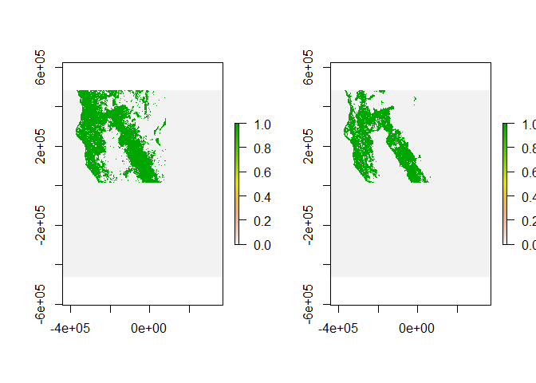
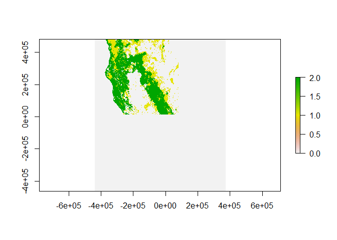

Species_Distributions
================
Cliff
2023-03-04

**Reference and Disclaimer:** For this exercise, I have used explanation
and codes from the book ***Spatial Ecology and Conservation Modeling***
by ***Robert Fletcher & Marie-Josée Fortin***.

Load the necessary packages

``` r
rm(list = ls())

## First specify the packages of interest
packages = c("raster","spatstat","rgdal","dismo","glmnet","mgcv","randomForest","reshape2","maxnet", "MuMIn","PresenceAbsence","ecospat","gridExtra")

## Now load or install&load all
package.check <- lapply(
  packages,
  FUN = function(x) {
    if (!require(x, character.only = TRUE)) {
      install.packages(x, dependencies = TRUE)
      library(x, character.only = TRUE)
    }
  }
)
par(mfrow = c(1, 1))
```

Import the required response data and check for the projections

``` r
setwd("D:/UGA/Academic Course Work/Fall-2022/FANR-8400-AdvGIS/Assignments/Ex3/")
#ogrListLayers("./data/CA_BBS_data.gdb")
ds2800 <- readOGR("./data/CA_BBS_data.gdb","ds2800")
#proj4string(ds2800)
btgw_2016 <- readOGR("./data/CA_BBS_data.gdb","BlackThroatedGreyWarbler_CA_BBS__2016")
#proj4string(btgw_2016)
btgw_2017 <- readOGR("./data/CA_BBS_data.gdb","BlackThroatedGreyWarbler_CA_BBS_2017_testing")
#proj4string(btgw_2017)
```

Converting the Spatial layers to dataframe

``` r
btgw_pres <- as.data.frame(btgw_2016)
ds_df <- as.data.frame(ds2800)
btgw_val_pres <- as.data.frame(btgw_2017)
```

# Training Data Preparation

Presence data is provided. Absence data was created using ds2800.
Filtering out for the species “Black-throated Gray Warbler” and setting
the year for 2016 to get training set.

``` r
# Presence data as given
#names(btgw_pres)
btgw_pres.xy <- as.matrix(btgw_pres[,c("coords.x1","coords.x2")])

# Absence data derived from ds2800 for the year 2016 and species not equals BTGW
ds16 <- subset(ds_df,Year==2016 & Cname!="Black-throated Gray Warbler")
#remove duplicates based on RtStopID - one point has multiple recordings
btgw_abs <- ds16[!duplicated(ds16$RtStopID),]
#names(btgw_abs)
btgw_abs$RtStopID <- NULL
btgw_abs.xy <- as.matrix(btgw_abs[,c("coords.x1","coords.x2")])
```

# Validation Data Preparation

Presence data is provided. Absence data was created using ds2800.
Filtering out for the species “Black-throated Gray Warbler” and setting
the year for 2017 to get validation set.

``` r
# Presence data as given
#names(btgw_val_pres)
btgw_val_pres <- btgw_val_pres[!duplicated(btgw_val_pres$RtStopID),]
btgw_val_pres$RtStopID <- NULL
btgw_val_pres.xy <- as.matrix(btgw_val_pres[,c("coords.x1","coords.x2")])

# Absence data derived from ds2800 for the year 2017 and species not equals BTGW
ds17 <- subset(ds_df,Year==2017 & Cname!="Black-throated Gray Warbler")
#remove duplicates based on RtStopID - one point has multiple recordings
btgw_val_abs <- ds17[!duplicated(ds17$RtStopID),]
#names(btgw_val_abs)
btgw_val_abs$RtStopID <- NULL
btgw_val_abs.xy <- as.matrix(btgw_val_abs[,c("coords.x1","coords.x2")])
```

Loading raster grids that contain relevant spatial information on the
covariates. Checking and setting the projections wherever required.

``` r
setwd("D:/UGA/Academic Course Work/Fall-2022/FANR-8400-AdvGIS/Assignments/Ex3/")
precip <- raster("D:/UGA/Academic Course Work/Fall-2022/FANR-8400-AdvGIS/Assignments/Ex3/data/PrismTemplate/PRISM_ppt_30yr_normal_800mM2_annual_albers.tif")
#proj4string(precip)
nlcd <- raster("D:/UGA/Academic Course Work/Fall-2022/FANR-8400-AdvGIS/Assignments/Ex3/data/N_CA_2019NLCD/N_CA_nlcd2019.img")
#proj4string(nlcd)
proj4string(nlcd)<- projection(precip)
dem <- raster("D:/UGA/Academic Course Work/Fall-2022/FANR-8400-AdvGIS/Assignments/Ex3/data/dem_CA_proj.ovr")
#proj4string(dem)
proj4string(dem) <- projection(precip)
```

The layers do not align because they are of different resolutions and
extent. Aligning the layers using resample() and cropping to same
extent. We use “ngb” method for a categorical variable, and “bilinear”
method for a continuous variable.

``` r
#compareRaster(precip,nlcd)
#resample to align layers
nlcd <- resample(x = nlcd, y = precip,"ngb")
#crop to same extent
precip_m <- mask(precip,nlcd)
#compareRaster(precip_m,nlcd)
```

Merge all the layers into a single raster stack of the environmental
covariates

``` r
par(mfrow = c(1, 2))
layers <- stack(nlcd, precip_m)
names(layers) <- c("nlcd", "precip")
#plot stack and correlations among covariates
pairs(layers, maxpixels=1000)                          #maxpixels sets upper limit on sampling raster
```

<!-- -->

``` r
plot(layers)
```

<!-- -->

Extracting covariate values at each point from the GIS layers

``` r
#extract GIS data
pres.cov <- extract(layers, btgw_pres.xy)
abs.cov <- extract(layers, btgw_abs.xy)
val_pres.cov <- extract(layers, btgw_val_pres.xy)
val_abs.cov <- extract(layers, btgw_val_abs.xy)

#link data
pres.cov <- data.frame(btgw_pres.xy, pres.cov, pres=1)
abs.cov <- data.frame(btgw_abs.xy, abs.cov, pres=0)

val_pres.cov <- data.frame(btgw_val_pres.xy, val_pres.cov, pres=1)
val_abs.cov <- data.frame(btgw_val_abs.xy, val_abs.cov, pres=0)

#remove any potential NAs
pres.cov <- pres.cov[complete.cases(pres.cov),]
abs.cov <- abs.cov[complete.cases(abs.cov),]

val_pres.cov <- val_pres.cov[complete.cases(val_pres.cov),]
val_abs.cov <- val_abs.cov[complete.cases(val_abs.cov),]

#bind presence and background points together
all.cov <- rbind(pres.cov, abs.cov)
val.cov <- rbind(val_pres.cov,val_abs.cov)
```

Inspect the training data

``` r
head(all.cov)
```

    ##    coords.x1 coords.x2 nlcd  precip pres
    ## 1 -259369.87 425915.82   42  686.81    1
    ## 2 -239483.47 125820.39   71 1198.95    1
    ## 3  -60757.41  93036.81   42 1230.28    1
    ## 4 -221365.13 384213.13   42 1149.49    1
    ## 5 -153071.12 254370.21   52  998.22    1
    ## 6 -239049.75 125361.26   42 1139.63    1

Inspect the training data

``` r
head(val.cov)
```

    ##    coords.x1 coords.x2 nlcd  precip pres
    ## 1 -259369.87  425915.8   42  686.81    1
    ## 2 -308599.75  185992.0   42 1970.67    1
    ## 3 -239483.47  125820.4   71 1198.95    1
    ## 4  -63239.04  111141.2   42 1095.88    1
    ## 5 -260117.13  426123.8   71  742.99    1
    ## 7  -54786.02  340286.1   52  300.44    1

# Envelop Model

Envelop Model uses the presence locations. The bioclim() from dismo
package calculates the percentiles of observed environmental covariates
at presence locations and the values of covariates at each location on
the map are compared to these percentiles.

``` r
#fit model
bioclim.btgw <- bioclim(layers, btgw_pres.xy)

#inspect
summary(bioclim.btgw)
```

    ##  Length   Class    Mode 
    ##       1 Bioclim      S4

Plot the environmental variation at (\~envelopes) the presence locations

``` r
par(mfrow = c(1, 3))
plot(bioclim.btgw, a=1, b=1, p=0.75)        # 75% quantile bounding box
plot(bioclim.btgw, a=1, b=1, p=0.85)        # 85% quantile bounding box
plot(bioclim.btgw, a=1, b=1, p=0.95)        # 95% quantile bounding box
```

<!-- -->

Creating predictive map using BIOCLIM model

``` r
#Model prediction
bioclim.map <- predict(layers, bioclim.btgw)

#plot
par(mfrow = c(1, 1))
plot(bioclim.map, axes=F, box=F, main="Bioclim")
```

<!-- -->

Note: Envelop Model illustrates the extent to which locations fall
within the environmental variation of observed locations. In doing so,
it may often over-predict distributions.

# Generalized linear models (GLMs)

GLMs are frequently used in distribution modeling and uses both
presence-absence observations.

``` r
#fit model
glm.btgw <- glm(pres ~ precip + nlcd, family=binomial(link=logit), data=all.cov)

#inspect
summary(glm.btgw)
```

    ## 
    ## Call:
    ## glm(formula = pres ~ precip + nlcd, family = binomial(link = logit), 
    ##     data = all.cov)
    ## 
    ## Deviance Residuals: 
    ##     Min       1Q   Median       3Q      Max  
    ## -0.6616  -0.3876  -0.3277  -0.2709   2.7172  
    ## 
    ## Coefficients:
    ##               Estimate Std. Error z value Pr(>|z|)    
    ## (Intercept) -2.0662205  0.4039097  -5.116 3.13e-07 ***
    ## precip       0.0004901  0.0001282   3.822 0.000132 ***
    ## nlcd        -0.0262985  0.0071989  -3.653 0.000259 ***
    ## ---
    ## Signif. codes:  0 '***' 0.001 '**' 0.01 '*' 0.05 '.' 0.1 ' ' 1
    ## 
    ## (Dispersion parameter for binomial family taken to be 1)
    ## 
    ##     Null deviance: 1284.8  on 2913  degrees of freedom
    ## Residual deviance: 1245.8  on 2911  degrees of freedom
    ## AIC: 1251.8
    ## 
    ## Number of Fisher Scoring iterations: 6

Creating predictive map using GLM model

``` r
#fit
glm.map <- predict(layers, glm.btgw, type="response")

#plot
plot(glm.map, axes=F, box=F, main="GLM")
```

<!-- -->

Note: Here we have considered linear relationships for all covariates.
In the predict(), we specified type as ‘response’ to make predictions on
the probability scale. Otherwise, predictions would be on the link scale
(the logit scale).

# Generalized additive models (GAMs)

We use *mgcv* package to fit GAM.

``` r
gam.btgw <- gam(pres~ s(precip) + s(nlcd), family=binomial(link=logit), method="ML", data=all.cov)
#inspect
summary(gam.btgw)
```

    ## 
    ## Family: binomial 
    ## Link function: logit 
    ## 
    ## Formula:
    ## pres ~ s(precip) + s(nlcd)
    ## 
    ## Parametric coefficients:
    ##             Estimate Std. Error z value Pr(>|z|)    
    ## (Intercept)  -3.1920     0.1251  -25.52   <2e-16 ***
    ## ---
    ## Signif. codes:  0 '***' 0.001 '**' 0.01 '*' 0.05 '.' 0.1 ' ' 1
    ## 
    ## Approximate significance of smooth terms:
    ##             edf Ref.df Chi.sq p-value    
    ## s(precip) 5.326  6.403 56.158  <2e-16 ***
    ## s(nlcd)   1.000  1.000  4.422  0.0355 *  
    ## ---
    ## Signif. codes:  0 '***' 0.001 '**' 0.01 '*' 0.05 '.' 0.1 ' ' 1
    ## 
    ## R-sq.(adj) =  0.0314   Deviance explained = 8.45%
    ## -ML = 599.42  Scale est. = 1         n = 2914

``` r
par(mfrow = c(1, 2))
plot(gam.btgw, shade=T)
```

<!-- -->

Tuning the GAM by manually setting the number of knots.

``` r
#Manually alter the number of knots
gam.btgw.knot3 <- gam(pres~ s(precip,k=3) + s(nlcd,k=3) , family=binomial(link=logit), method="ML", data=all.cov)
gam.btgw.knot6 <- gam(pres~ s(precip,k=6) + s(nlcd,k=6), family=binomial(link=logit), method="ML", data=all.cov)

#plot relationships and compare
par(mfrow = c(1, 2))
plot(gam.btgw.knot3, shade=T)
```

<!-- -->

Creating predictive map using GAM model

``` r
gam.map <- predict(layers, gam.btgw, type="response")

#plot
par(mfrow = c(1, 1))
plot(gam.map, axes=F, box=F, main="GAM")
```

<!-- -->

Note: As the number of knots increase, the complexity of the smoother
increases.

# Random Forest Model

The randomForest package can model both categorical (classification) and
continuous (regression) response variables. Here we implement a
classification model.

``` r
#Default random forest model
rf.btgw <- randomForest(as.factor(pres) ~ precip + nlcd, na.action=na.omit, data=all.cov)
summary(rf.btgw)
```

    ##                 Length Class  Mode     
    ## call               4   -none- call     
    ## type               1   -none- character
    ## predicted       2914   factor numeric  
    ## err.rate        1500   -none- numeric  
    ## confusion          6   -none- numeric  
    ## votes           5828   matrix numeric  
    ## oob.times       2914   -none- numeric  
    ## classes            2   -none- character
    ## importance         2   -none- numeric  
    ## importanceSD       0   -none- NULL     
    ## localImportance    0   -none- NULL     
    ## proximity          0   -none- NULL     
    ## ntree              1   -none- numeric  
    ## mtry               1   -none- numeric  
    ## forest            14   -none- list     
    ## y               2914   factor numeric  
    ## test               0   -none- NULL     
    ## inbag              0   -none- NULL     
    ## terms              3   terms  call

Creating predictive map using Random Forest model

``` r
#fit
rf.map <- predict(layers, rf.btgw, type="prob",index=2)

#plot
plot(rf.map, axes=F, box=F, main="RF")
```

<!-- -->

# Model Evaluation

The dismo package includes the evaluation function,but here we use the
PresenceAbsence package (Freeman and Moisen 2008), which includes a more
comprehensive set of evaluation metrics.We start by creating a data
frame that includes (1) ID column; (2) the observed responses in the
validation data; and (3) model predictions for those locations.

``` r
library(PresenceAbsence)
val.cov.pred <- val.cov[,cbind("nlcd","precip")]
bio.val <- predict(bioclim.btgw, val.cov.pred)
glm.val <- predict(glm.btgw, val.cov.pred, type = "response")
gam.val <- predict(gam.btgw, val.cov.pred, type = "response")
rf.val <- predict(rf.btgw, val.cov.pred, type = "prob")
rf.val <- rf.val[,2]

val.data <- data.frame(ID = 1:nrow(val.cov), Observed =
                         val.cov$pres, bio = bio.val, glm = glm.val, gam = gam.val, rf =
                         rf.val)

summary.eval <- data.frame(matrix(nrow = 0,ncol = 6))
nmodels <- ncol(val.data)-2
for(i in 1:nmodels){
  #auc.i <- auc(val.data, which.model = i)
  kappa.opt <- optimal.thresholds(val.data, which.model=i, opt.methods=3)
  sens.i <- sensitivity(cmx(val.data, which.model=i,threshold = kappa.opt[[2]]))
  spec.i <- specificity(cmx(val.data, which.model=i,threshold = kappa.opt[[2]]))
  tss.i<- sens.i$sensitivity +spec.i$specificity - 1
  kappa.i <- Kappa(cmx(val.data, which.model=i,threshold = kappa.opt[[2]]))
  summary.i <- c(i, kappa.opt[[2]], sens.i$sensitivity, spec.i$specificity, tss.i, kappa.i[[1]])
  summary.eval <- rbind(summary.eval, summary.i)  
}
colnames(summary.eval)<-c("Model", "Threshold","Sensitivity", "Specificity", "True Skill Statistic", "Kappa")
summary.eval$Model <- c("Bioclim", "GLM", "GAM", "RF")
summary.eval
```

    ##     Model Threshold Sensitivity Specificity True Skill Statistic      Kappa
    ## 1 Bioclim      0.31   0.6543779   0.6560107            0.3103885 0.10183798
    ## 2     GLM      0.05   0.8709677   0.4881785            0.3591462 0.08499075
    ## 3     GAM      0.07   0.7880184   0.6293706            0.4173891 0.12721903
    ## 4      RF      0.01   0.5023041   0.8604729            0.3627770 0.21790918

``` r
#grid.table(summary.eval,rows=NULL)
```

# Ensemble Model

A common approach to Ensemble is to make a weighted average of
predictions from models based on AUC for each model or some other model
evaluation metric (Marmion et al. 2009). Here we used model threshold to
do ensemble as auc() throws error while in *RMarkdown* but runs just
fine in R command prompt.

``` r
#Get thresholds identified in PresenceAbsence
thres.glm <- summary.eval[summary.eval$Model=="GLM", "Threshold"]
thres.gam <- summary.eval[summary.eval$Model=="GAM", "Threshold"]

#Create binary maps
glm.thres.map <- glm.map
gam.thres.map <- gam.map

values(glm.thres.map) <- 0
values(gam.thres.map) <- 0
glm.thres.map[glm.map > thres.glm] <- 1
gam.thres.map[gam.map > thres.gam] <- 1

#plot
par(mfrow = c(1, 2))
plot(glm.thres.map)
plot(gam.thres.map)
```

<!-- -->

Ensemble mapping based on frequency

``` r
#Ensemble mapping based on frequency
ensemble.freq <- glm.thres.map + gam.thres.map
#plot
par(mfrow = c(1, 1))
plot(ensemble.freq)
```

<!-- -->
